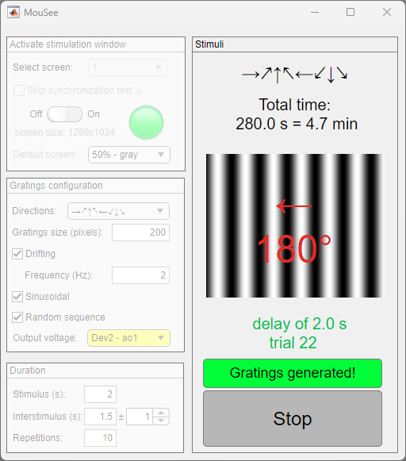

## MouSee
Graphical user interface GUI to generate visual stimulation protocols of drifting/static gratings using Psychtoolbox and a DAQ (optional) to get the stimulation type and time in a voltage output.

This program uses two screens: one for visual stimulation and one for setting and controlling the visual stimulation protocol.

1. Run `MouSee.m`.
2. Select the screen for visual stimulation. 
3. Turn on the app switch to initialize the monitor (using Psychtoolbox functions).
4. Set the default screen (white, black, gray, gratings, etc.).
5. Set the parameters of the gratings: drifting, directions, size, and frequency. 
6. Set if you want a random sequence and if you want sinusoidal gratings. 
7. (Optional) Select an output voltage channel of a NI-DAQ for recording the type and time of the stimulation. 
8. Set the duration of the stimulus, the duration of the interstimulus (as default screen).
9. Set the number of repetitions. 
10. Preview the visual stimulation protocol and the total time on the right panel.
11. Generate the images clicking on the button "Generate gratings".
12. Press Run to start the protocol.

You need a NI-DAQ to send an analog output to record the type and time of visual stimulation. Output voltage of 0 V means no visual stimulation (gray screen), different values mean different directions. For example, if you choose 8 different directions (0º, 45º, 90º, 135º, 180º, 225º, 270º and 315º) the output voltage will use 8 different levels of voltage in order to identify them (0.5, 1, 1.5, 2, 2.5, 3, 3.5 and 4 V).

Note: in our projects where we use black/blue stimuli, we turn off the channels red and green directly from the stimulation monitor.

## Citation
If you use **_MouSee_**, please cite our papers [NatComms](https://www.nature.com/articles/s41467-024-47515-x) and/or [eLife](https://elifesciences.org/articles/64449):
> Pérez-Ortega, J., Akrouh, A. & Yuste, R. 2024. Stimulus encoding by specific inactivation of cortical neurons. Nat Commun 15, 3192. doi: 10.1038/s41467-024-47515-x

> Pérez-Ortega J, Alejandre-García T, Yuste R. 2021. Long-term stability of cortical ensembles. Elife 10:1–19. doi:10.7554/eLife.64449

# GUI
This is an example of the graphical user interface during visual stimulation.

